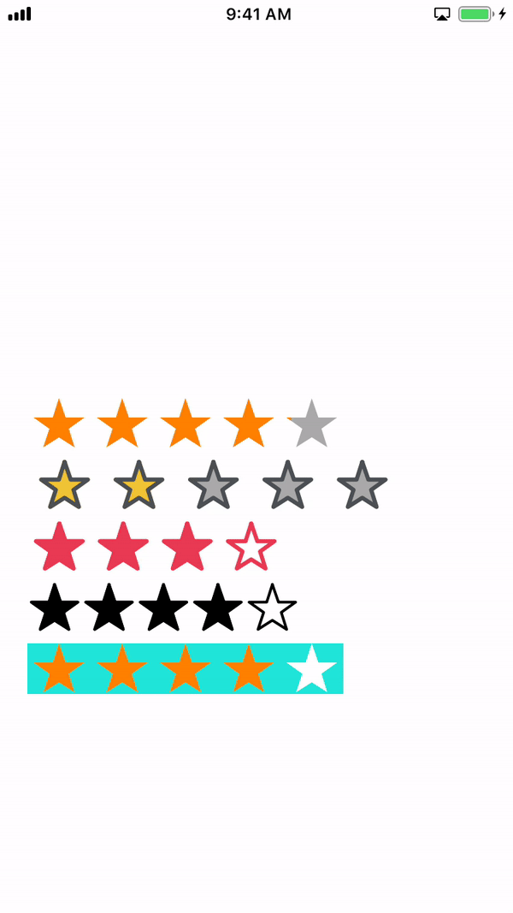

# ARKRating

## Overview
This framework allows iOS developers to add a rating control to their app as shown in the demo section.

## Demo

## Requirements
* iOS 8.0 or higher
## Usage
### Setup using CocoaPods
1. Change directory to your project directory

    `cd project-directory`
2. Initialize the directory with CocoaPods. This step will create a `Podfile` file where you will specify your dependencies.

    `pod init`
3. Open the `Podfile` file in a text editor. 

    `nano Podfile`
4. Add the following line to the `Podfile`

    `pod 'ARKRating'`
5. Save the file. Then run

    `pod install`

### Setup manually
Copy the Source folder of the projecr `ARKRating` to your project.

### Quick start guide
This repo contains an example project named `ARKRatingExample` for illustration purposes. You can either use the storyboard to add this widget to your app or add it in code. 
#### Storyboard method
1. Go to `Main.storyboard`
2. Add a `UIView` from the `Object Library`
3. Change its class to `ARKRating` in the class inspector tab
4. Adjust the configurable properties as needed:
    
    * Max Rating
    * Current Rating
    * Rating Border Color
    * Rating Border Width
    * Rating Color
    * Rating Inner Color 

#### Adding in code method
First, import the library into a view controller.
```swift
import ARKRating
```

Create a property of type `ARKRatingControl`.
```swift
    let ratingControl: ARKRatingControl = {
        // Create an instance of ARKRatingControl
        let ratingControl = ARKRatingControl()
        // Set this to false if using Autolayout
        ratingControl.translatesAutoresizingMaskIntoConstraints = false

        // Configurable properties
            // Number of items in the widget
        // ratingControl.maxRating = 5
            // Current rating
        // ratingControl.currentRating = 2.5
            // Color properties
        // ratingControl.ratingBorderColor = .darkGray 
        // ratingControl.ratingBorderWidth = 1
        // ratingControl.ratingColor = .orange
        // ratingControl.ratingInnerColor = .lightGray

        // Add a target to receive state change updates 
        ratingControl.addTarget(self, action: #selector(ratingControlValueChanged), for: .valueChanged)
        return ratingControl
    }()
```
Add a callback function to receive state change updates.
```swift
    @objc func ratingControlValueChanged(){
        print(self.ratingControl.currentRating)
    }
```
Add the control to the view.
```swift
 override func viewDidLoad() {
        super.viewDidLoad()
        // Do any additional setup after loading the view.
        
        // Add to view
        self.view.addSubview(self.ratingControl)

        // Setup autolayout constraints or frame 
        self.ratingControl.centerXAnchor.constraint(equalTo: self.view.centerXAnchor).isActive = true
        self.ratingControl.centerYAnchor.constraint(equalTo: self.view.centerYAnchor).isActive = true
        self.ratingControl.heightAnchor.constraint(equalToConstant: 40).isActive = true
        self.ratingControl.widthAnchor.constraint(equalToConstant: 240).isActive = true

        // or do
        // self.ratingControl.frame = CGRect(x: 0, y: 0, width: 240, height: 40)
    }
```
That's it. You now have a highly configurable rating control in your app. 

## Contributors
1. Aswin Raj Kharel

## Contributing 
Feel free to contribute to this repo or open an issue to request features or report bugs. 


